# WGU Mobile Application Developmenet - C196

## Overview
This Android application is a basic student scheduler as defined by the requirements of C196.  It allows a student to:

- Track Terms
- Track Courses in a given Term
- Track Assessments in a given Course
- Track Mentors and their contact information and associate them with a Course

## Android Version and Hardware
This project was designed to be used with Android API 28 (Pie).  This project was tested on a Pixel XL (Physical and Emulator).  See the list of Libraries used for additional versioning information.

## Libraries Used
As of submission, here is the list of libraries used in the gradle file:

```gradle
dependencies {
    implementation 'androidx.room:room-runtime:2.1.0'
    annotationProcessor 'androidx.room:room-compiler:2.1.0'
    implementation fileTree(include: ['*.jar'], dir: 'libs')
    implementation 'androidx.appcompat:appcompat:1.1.0-rc01'
    implementation 'androidx.constraintlayout:constraintlayout:1.1.3'
    implementation 'com.google.android.material:material:1.1.0-alpha07'
    testImplementation 'junit:junit:4.12'
    androidTestImplementation 'androidx.test:runner:1.3.0-alpha01'
    androidTestImplementation 'androidx.test.espresso:espresso-core:3.3.0-alpha01'
    implementation 'com.jakewharton:butterknife:10.1.0'
    annotationProcessor 'com.jakewharton:butterknife-compiler:10.1.0'
    implementation 'androidx.lifecycle:lifecycle-extensions:2.0.0'
    implementation 'androidx.recyclerview:recyclerview:1.1.0-beta01'
    implementation 'com.android.support:design:28.0.0'
    implementation 'com.android.support:appcompat-v7:28.0.0'
    implementation 'com.android.support:support-v4:28.0.0'
    implementation 'com.android.support.constraint:constraint-layout:1.1.3'
}
```

## How to build
Open this project in Android Studio and build.  As long as the gradle file is there, everything should build successfully.

## StoryBoard and How to Use the App
The app consists of 1 primary activity and 4 sub activities.

### The Main Activity
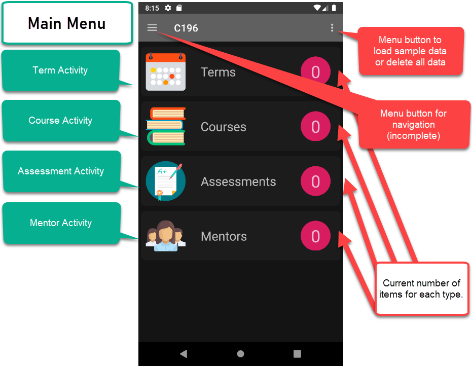

The main screen provides navigation to the 4 sub-activities.  I intended to create a navigation drawer but it would have required me to completely revamp the project.  I did leave it in there because it is how I would like it to look if given the chance.

**The Navigation Drawer**

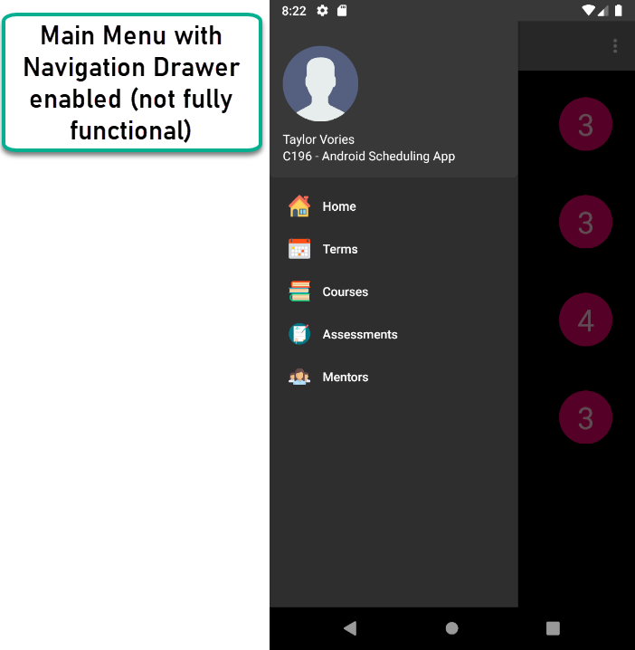

The app features a menu bar that allows the user to load sample data or delete the database data and start over.

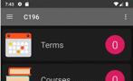

#### Navigate to the Sub-Activities

In order to navigate to the sub-activies of the app, simply click on any of the icons or titles (Terms, Courses, etc.)

### Term Activity

The Term activity allows the user to view their terms.  They can go to a detailed view of the term by clicking on the card (anywhere except for the edit icon) or edit the term by clicking the edit Floating Action Button.  They can also create a new term by hitting the + button.

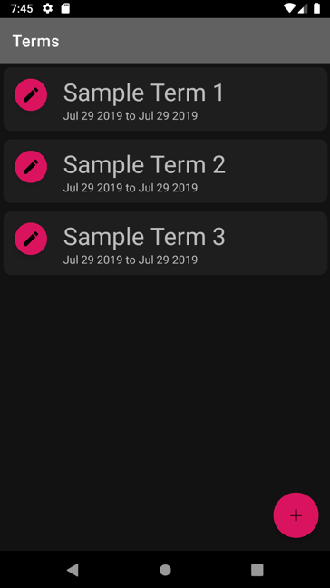

#### Term Edit Activity

By selecting the edit icon Floating Action Button, the user navigates to the Term Edit Activity (`TermEditActivity.java`).  In that activity, the user can edit the Term title, start date, end date, or delete the term.

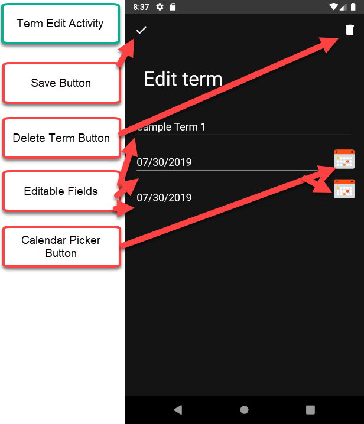

When the user is done editing, they can hit the Save button in the top left of the screen to save the edited term.

#### Term Details Activity

By selecting the Term CardView ([Shown here](#term-activity)), the user opens the Term Detail Activity (`TermDetailsActivity.java`).  The Term Detail Activity allows the user to view the term details as well as add or remove courses in a term.

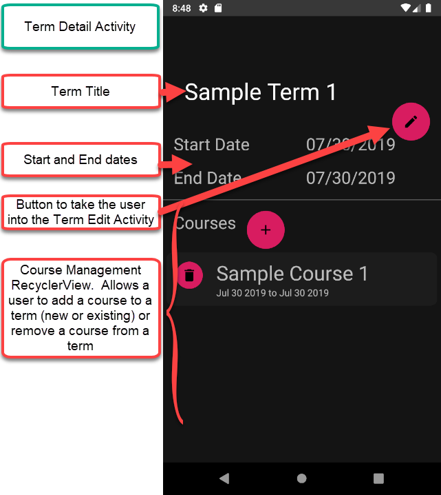

##### Add a Course to a Term

To add a course to a term, the user should click the + icon in the Term Detail Activity.  If the user chooses the *New* course option, they will be taken to the [Course Edit Activity](#courses-activity).

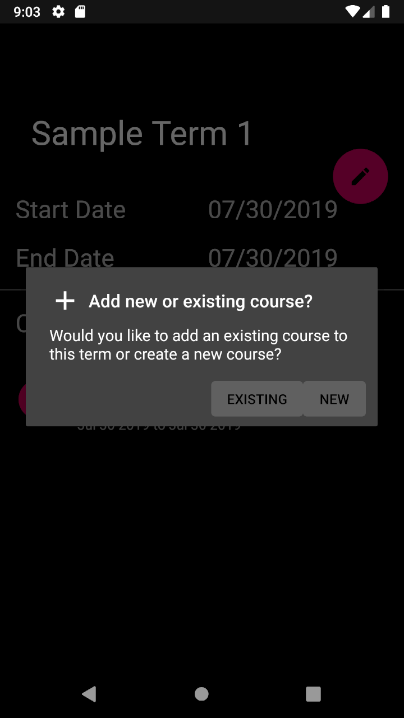

If the user wants to add an existing course to a term, they can select the Existing option.  This will create a dropdown list of any Courses that are currently not assigned to a term.

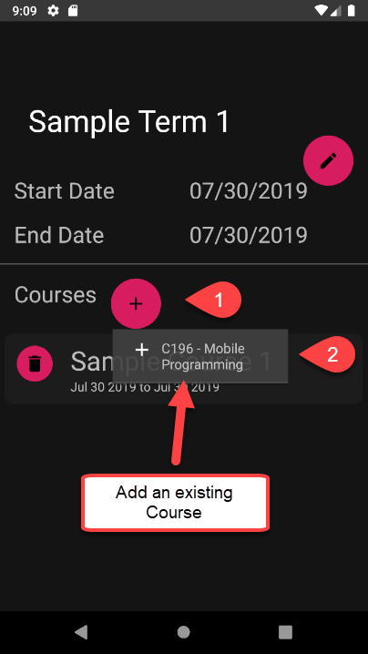

Once the course is added, it will show up in the Term Details section.

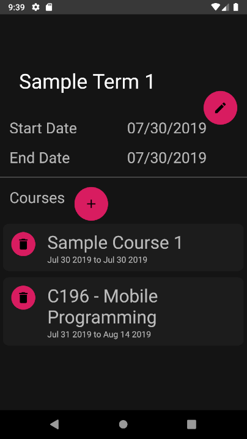


### Courses Activity

The Courses activity allows the user to view their courses.  They can view details, edit the course, or add a new course.  A dialog message will display asking the user whether they want to create a new Course or add an existing course.  This allows the user to move a course to a different term.

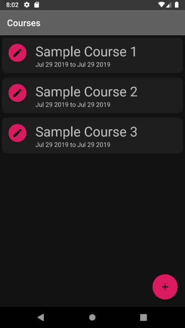

#### Course Edit Activity

By selcting one of the Edit buttons for an existing course or the + button for a new course.  You can add the details for the course and then save it with the Save button or delete it (if already existing) with the delete button.

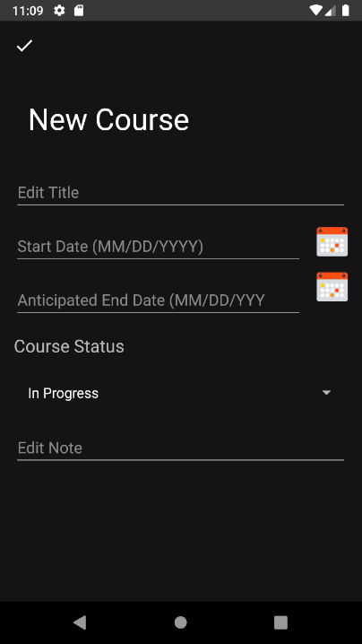

#### Course Detail Activity

By selecting the Course CardView ([Shown here](#courses-activity)), the user opens the Course Detail Activity (`CourseDetailsActivity.java`).  The Course Detail Activity allows the user to view the course details as well as add or remove Assessments and Mentors in a term.

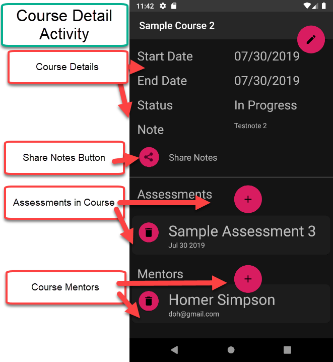

##### Add an Assessment to a course

By clicking the + button in the Assessment section ([see here](#courses-activity)) to add an existing assessment to a course or to create a new assessment for that course.

If the user chooses the *New* Assessment option, they will be taken to the [Assessment Edit Activity](#assessment-activity).

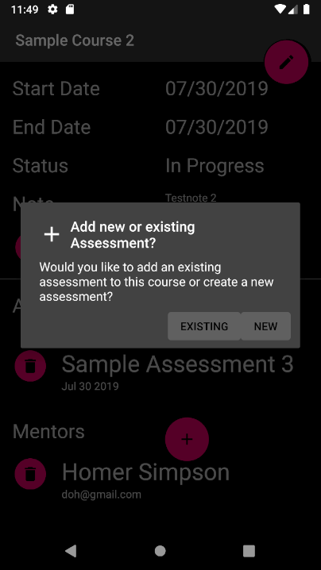

If the user wants to add an existing Assessment to a course, they can select the Existing option.  This will create a dropdown list of any Assessments that are currently not assigned to another course.

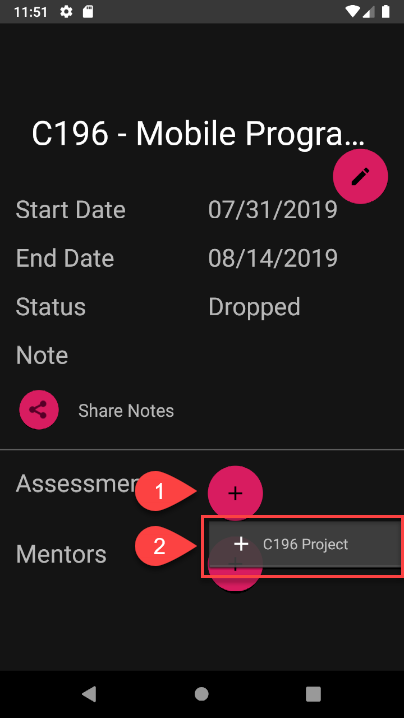

Once the Assessment is added, it will show up in the Course Details section.

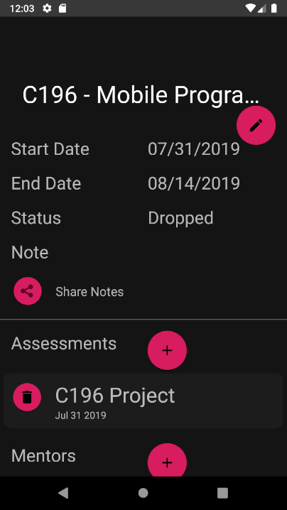

##### Add a Mentor to a Course

This process is the same as the [Add Assessment to a Course](#add-an-assessment-to-a-course) process.

### Assessment Activity

The Assessment activity allows the user to view their assessments and their due dates.  They can view details, edit the Assessment, or add a new Assessment.  A dialog message will display asking the user whether they want to create a new Assessment or add an existing Assessment.

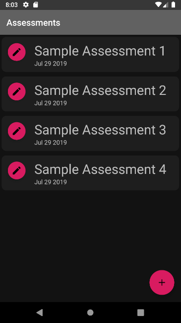

#### Assessment Edit Activity

By selcting one of the Edit buttons for an existing Assessment or the + button for a new Assessment.  You can add the details for the Assessment and then save it with the Save button or delete it (if already existing) with the delete button.

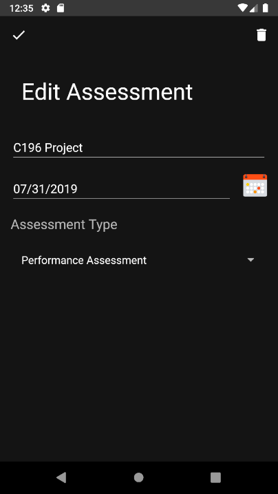

#### Assessment Detail Activity

By selecting the Assessment CardView ([Shown here](#assessment-activity)), the user opens the Assessment Detail Activity (`AssessmentDetailsActivity.java`).  

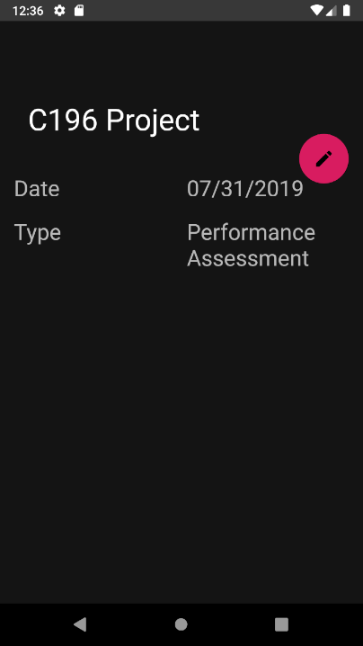

### Mentor Activity

The mentor activity provides a location for the user to view their course mentors and their contact information.  Mentors can be assigned to a course in the course details page.


#### Mentor Edit Activity

By selcting one of the Edit buttons for an existing Mentor or the + button for a new Mentor.  You can add the details for the Mentor and then save it with the Save button or delete it (if already existing) with the delete button.

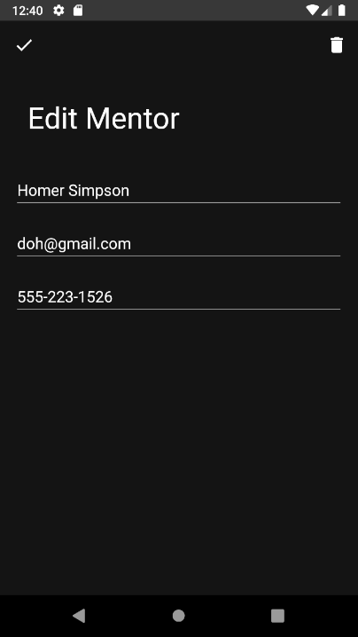

#### Mentor Detail Activity

By selecting the Mentor CardView ([Shown here](#mentor-activity)), the user opens the Mentor Detail Activity (`MentorDetailsActivity.java`).  

